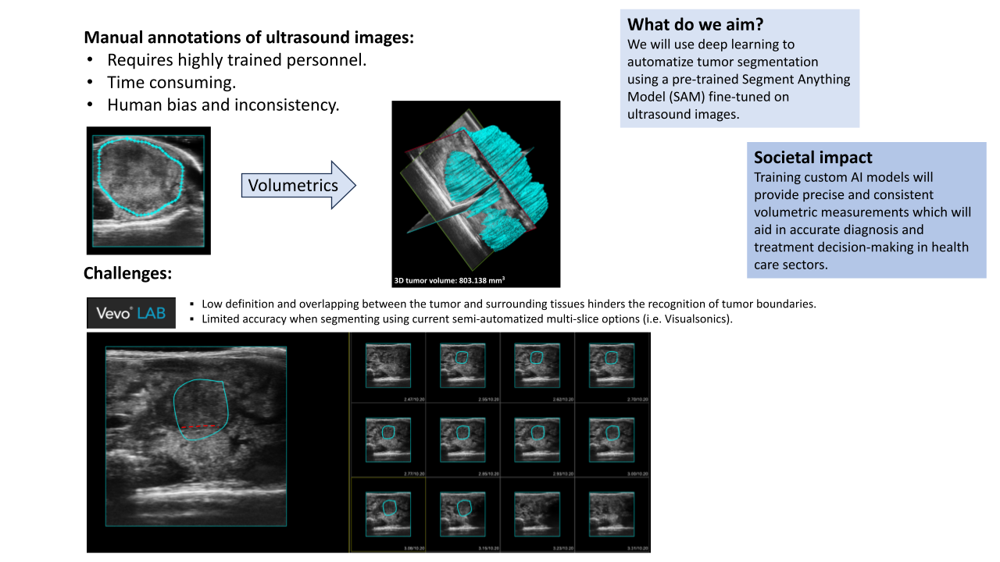

# ParaSAM
Deep learning in Medical images for tumor segmentation and volumetrics: From human bias to AI precision

&nbsp;

&nbsp;

&nbsp;

&nbsp;

ParaSAM (from the Greek prefix Para- meaning ‘Beyond’ and SAM from ‘Segment Anything Model’) is an advanced tool designed for precise segmentation and volumetric analysis of tumors in medical images, developed using OpenCV and Unity. As a significant evolution and refinement of the "SAM" model, ParaSAM specifically addresses the challenges in detecting and analyzing pancreatic tumors.

Abstract

Manual annotation in medical imaging faces significant challenges including susceptibility to human bias, time consumption, and inaccurate image interpretation either in research and healthcare settings. 

In the OpenCV AI Contest 2023, our project "ParaSAM" introduces a groundbreaking approach for tumor segmentation and volumetrics in medical images, leveraging deep learning to transcend human biases inherent in manual annotation. This collaborative effort with Umeå University and Daniel Öhlund Lab focuses on pancreatic cancer research, utilizing an extensive dataset of 3D ultrasound images from a KPC mouse model. ParaSAM builds upon the MedSAM model, refining it for enhanced accuracy in automatic detection and segmentation of pancreatic tumors. We developed an interactive 3D application using Unity and OpenCV for importing ultrasound images, performing automatic segmentation, and visualizing tumors in 3D. Our preliminary results demonstrate significant improvements in tumor detection and volumetric analysis over conventional methods, marking a crucial step towards precision oncology diagnostics. 

For full report check PDF [here](media-readme/ParaSAM%20-%20OpenCV%20AI%202023%20contest.pdf) and [hackster contest entry](https://www.hackster.io/parasam/parasam-a2dcde)

Video link [here](https://youtu.be/qNulJCA25TQ)

[video]

## Repo structure
2023/11/30: Initial delivery for OpenCV AI 2023 contest

This repo contains three main folders:
- MedSAM: 'fork' of MedSAM v0.1 branch with our ParaSAM.py python script to perform fine-tuning and inference

- ParaSAM: Unity project with two main scenes to perform preprocessing before training and postprocessing with 3D tumor reconstruction

- Data: Folder with 8 sequences (initial scope)

## Setup

**We provide .zip file under [Releases](https://github.com/gespona/ParaSAM/releases) with Windows binaries for preprocess and 3D reconstruction with Data folder generated. So don't really need to save any preprocess or do any training to evaluate the work here.**

That said, following instructions allows any user to go through the whole process, using binaries or Unity project itself (paid third-party assets needed). For training you need to follow instruction to setup python env. 

Clone this repo on your local machine

`git clone https://github.com/gespona/ParaSAM.git`

### Unity project (pre and post process)

It's recommended to run Windows binaries you can find under [Releases](https://github.com/gespona/ParaSAM/releases), as this project uses paid third party assets:

- OpenCV For Unity [Unity AssetStore](https://assetstore.unity.com/packages/tools/integration/opencv-for-unity-21088)
- Voxel Play [Unity AssetStore](https://assetstore.unity.com/packages/tools/game-toolkits/voxel-play-2-201234)
- Universal Orbit Camera [Unity AssetStore](https://assetstore.unity.com/packages/tools/camera/universal-orbit-camera-244133)

In case you want to check directly the Unity project:
- Install Unity 2021.3.28f or superior from [Unity](https://www.unity.com)
- Add project from local disk under folder ParaSAM
- Install paid third-party assets to avoid compilation errors

DISCLAIMER: We don't have any relationship or liability with the third-party assets

(at your own risk) Is it possible to use free OpenCV Unity asset with small modifications of the code but this asset is not maintaneid anymore

### ParaSAM 

1. Create a virtual environment `conda create -n parasam-env python=3.10 -y` and activate it `conda activate parasam`
2. Install [Pytorch 2.0](https://pytorch.org/get-started/locally/)
3. Enter the MedSAM folder `cd MedSAM` and run `pip install -e .`

## Get started. Tumor 3D reconstruction

### Run windows binary

1. Inside release .zip file go to reconstruction folder and execute reconstruction.exe
2. Click on load inference
3. Explore data with prev and next buttons
4. Run reconstruction
5. You can inspect the 3D tumor moving mouse (orbit and zoom)

### Unity project

1. Open scene called Reconstruction
2. Hit play
3. Interact in the same way as binary above

## Pre-process and Model training

For pre-process the data you can either use binary or unity project:

### Run windows binary

1. Inside release .zip file go to preproc folder and execute preproc.exe
2. Click on preprocess (this could take several minutes)
3. Interact with prev and next buttons (bottom part)
4. You can save preprocess using Save preprocess button
5. You can generate train and validation sets using Gen Train Set button

### Unity project

1. Open scene called Preproc
2. Hit play
3. Interact in the same way as binary above

For model training follow next steps. Command line example using KPCMIX1 dataset:

1. Inside MedSAM folder

`cd MedSAM`

2. Preprocess train and validation folder results of Unity preprocess and generate .npz file for training

`python .\pre_grey_rgb2D.py -i .\data\KPCMIX1\Train\images\ -gt .\data\KPCMIX1\Train\labels\ -o .\data\KPCMIX1 --data_name kpcmix1 --checkpoint .\work_dir\MedSAM\medsam_vit_b.pth`

3. First 200 epochs training (using MedSAM checkpoint as base)

`python .\parasam.py --mode train --compare_models --checkpoint .\work_dir\MedSAM\medsam_vit_b.pth --epochs 200 --data_folder .\data\KPCMIX1\ --npz_folder .\data\KPCMIX1_vit_b\ --task_name kpcmix1`

4. To continue training, notice we want to use our best checkpoint from the previous training. We will use another folder (copy) to point previous checkpoint.

`python .\parasam.py --mode train --compare_models --checkpoint .\work_dir\kpcmix1_bbb_medsam\sam_model_best.pth --epochs 200 --data_folder .\data\KPCMIX1\ --npz_folder .\data\KPCMIX1_vit_b\ --task_name kpcmix1`

5. Once we're happy with training results, we can perform inference

`python .\parasam.py --mode inference --checkpoint .\work_dir\kpcmix1_bbb_medsam\sam_model_best.pth --npz_folder .\data\KPCMIX1_vit_b\ --task_name kpcmix1 --data_folder .\data\KPCMIX1\ --compare_inference`

or

`python .\parasam.py --mode inference --checkpoint .\work_dir\kpcmix1_bbb_medsam\sam_model_best.pth --npz_folder .\data\KPCMIX1_vit_b\ --task_name kpcmix1 --data_folder .\data\KPCMIX1\ --inference_all`

## Acknowledgements

We thank MedSAM authors for opening the [code](https://github.com/bowang-lab/MedSAM), model checkpoint and instructions on further fine-tuning and for extension we thank Meta AI for making the source of SAM publicly available

